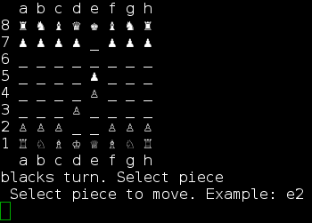

#### chess.py
chess.py is small, text-based chess game

#### History

chess.py was written during freetime between December 2013 and January 2014, but was abandoned near-completion of terminal-based gameplay. In May 2017 (4 years and 4 months later), development resumed.

#### Requirements
Currently, [python3](http://www.python.org/getit/) is the only dependency, so the game *should* also run on Windows and MacOS X.

Chess pieces are represented with the standard [unicode characters](http://en.wikipedia.org/wiki/Chess_symbols_in_Unicode)

In the future I will add a graphical user interface (likely using the 'pygame' library)

(The game is currently completely terminal/command-line based. At the moment, the player selects pieces by typing the coordinates (eg. 'e2' followed by 'e4' to play the famous "[King's Pawn](https://en.wikipedia.org/wiki/King%27s_Pawn_Game)" opening move).)

#### Features
Core gameplay is complete, but some chess mechanics are not yet implemented:
- [x] Pawn
  - [x] Promotion
  - [] [En passant](https://en.wikipedia.org/wiki/En_passant) special capture
- [x] Knight
- [x] Bishop
- [x] King
  - [x] King/Rook Castling
- [x] Rook
- [x] Queen
- [x] Main game logic: Turn-based basic playable game mechanics
- [x] Check/checkmate detection
- Draw detection
    - [] [Stalemate](https://en.wikipedia.org/wiki/Stalemate)
    - [] [50-move rule](https://en.wikipedia.org/wiki/Fifty-move_rule)
    - [] [3-fold repetition](https://en.wikipedia.org/wiki/Threefold_repetition)
    - [] Impossibility of checkmate ("insufficient mating material rule")
- [] Graphical user interface with move selection through mouse clicks (and highlighting legal moves of selected piece)
- [] Computer player with AI communicating to separate server using JSON messages

## Screenshots

